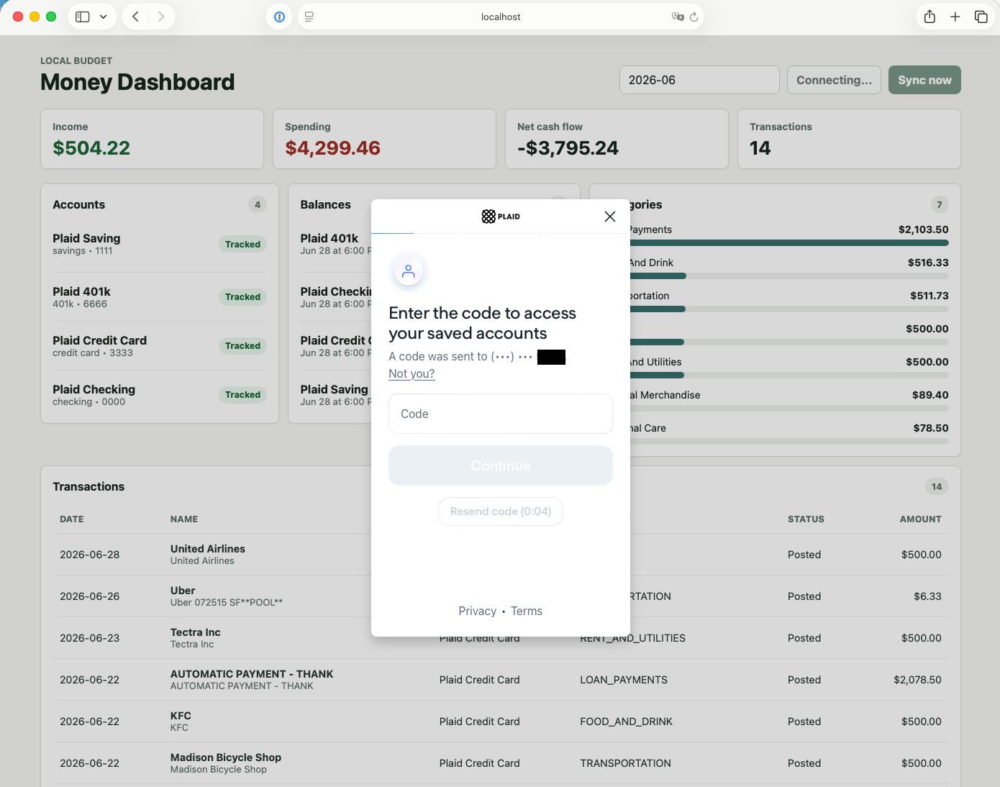

# Local Budget

A local-first personal budgeting app with a Java Spring Boot backend, CSV persistence, Plaid integration, and a React/Vite money dashboard.



## Why I Built This

While doing personal budgeting, I hated that I had to pay a subscription fee just to fetch my own banking data. I did not need fancy features like canceling subscriptions for me. I just needed a quick, easy way to see how much I was spending and where the money was going.

With the current age of agentic coding, I figured: why not just create it myself?

So here is my Budgeting App, designed to run locally. If you need fewer than 10 Plaid connections, which I hope is true for personal budgeting, the free tier of Plaid should be enough. If you have more than that, I highly suggest consolidating the data somewhere :P

The goal is simple: connect accounts, sync transactions, see balances, review spending by category, and keep the data local.

## Features

- Plaid Link account connection
- Transaction sync from Plaid
- Balance snapshots
- Monthly income, spending, and net cash flow
- Category breakdowns
- Local CSV persistence
- Local React dashboard

## Attribution

This project was originally created by Tommy. See [NOTICE](NOTICE) for attribution details.

## Run Locally

Requires Java 21+ for the backend and Node.js for the frontend.

Backend:

```bash
cd backend
PLAID_CLIENT_ID=your_client_id PLAID_SECRET=your_secret mvn spring-boot:run
```

Frontend:

```bash
cd frontend
npm install
npm run dev -- --host 127.0.0.1
```

Open `http://127.0.0.1:5173`.

## Data Files

The backend writes local CSV data under `backend/data` by default:

- `accounts.csv`
- `plaid_items.csv`
- `transactions.csv`
- `balance_snapshots.csv`
- `sync_runs.csv`

Override the location with:

```bash
BUDGET_DATA_DIRECTORY=/path/to/data
```

## Plaid

The app defaults to Plaid sandbox:

```bash
PLAID_ENV=sandbox
```

Use Plaid development or production only after your Plaid account and product access are configured. For a small personal budgeting setup, the Plaid free tier can be enough if you stay within the available connection limits.

## Verify

Backend:

```bash
cd backend
mvn test
mvn spotless:check
```

Frontend:

```bash
cd frontend
npm run build
npm audit
```
