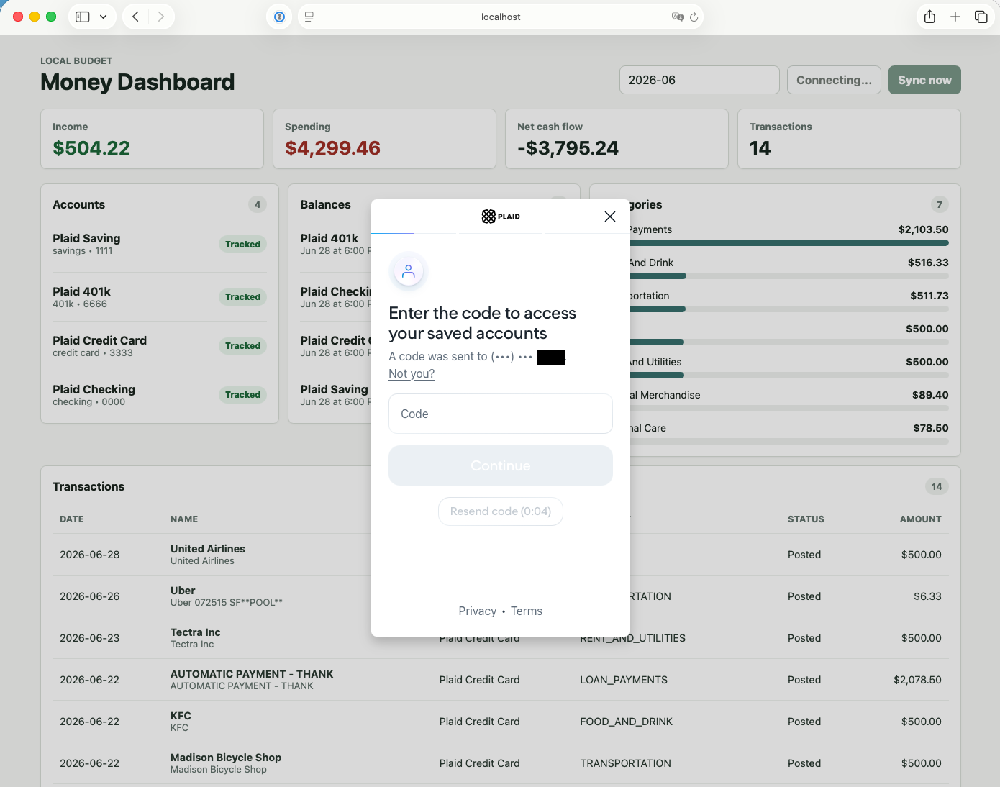

# Open Budget

A local-first personal budgeting app with a Java Spring Boot backend, CSV persistence, Plaid integration, and a React/Vite dashboard for answering the ancient question: "Where did my money go this time?"



## Why I Built This

While doing personal budgeting, I kept running into the same mildly annoying problem: paying a subscription fee just to fetch my own banking data. I did not need a fancy finance butler to cancel subscriptions, negotiate bills, or tell me that buying coffee is why retirement is impossible. I just wanted a quick, easy way to see how much I was spending and where the money was going.

And with the current age of agentic coding (and my professional background), I figured: why not just build it myself and let the machines do something useful for once?

So here it is: a budgeting app designed to run locally, keep the data close, and avoid turning basic spending visibility into yet another monthly bill.

If you need fewer than 10 Plaid connections, (which I sincerely hope is true for you) the Plaid free tier should be enough. If you have more than that, I gently suggest consolidating a few bank accounts before your spreadsheet develops lore.

The goal is simple: connect accounts, sync transactions, see balances, review spending by category, and keep the data local. No subscription dashboard for your subscription dashboard.

## Features

- Plaid Link account connection
- Transaction sync from Plaid
- Balance snapshots
- Monthly income, spending, and net cash flow
- Category breakdowns
- Local CSV persistence
- Local React dashboard

## Planning

- [Future development plan](docs/plan/future-development-plan.md)
- [AI model integration plan](docs/plan/2026-07-01%20AI%20model%20integration%20for%20budgeting%20suggestions.md)

## Attribution

This project was originally created by Tommy. See [NOTICE](NOTICE) for attribution details.

## Run Locally

Requires Java 21+ for the backend and Node.js for the frontend.

Backend:

```bash
cd backend
mvn spring-boot:run
```

Plaid environment variables are optional. Without them, the backend still starts and the
frontend opens a first-run setup screen. Credentials entered there are validated with Plaid and
saved under the configured data directory. Encryption is optional and off by default.

Leave **Encrypt my local financial data** off to save credentials in plaintext `secrets.json`
and keep CSV files unencrypted. No password is required, and the app is ready after restart.
Enable it to encrypt credentials in `secrets.json.enc` and data in `.csv.enc` files. Only then
are password and confirmation enabled and required. The password must contain at least 12
characters; it is not saved and cannot be recovered. Use it to unlock after restarting.
Encryption verifies the encrypted data before removing the original plaintext files, without creating unencrypted backups. Existing encrypted
setups still require their original password; choosing plaintext during setup cannot downgrade them.
Environment-provided credentials remain available as a development override and start the app in
the ready state:

```bash
PLAID_CLIENT_ID=your_client_id \
PLAID_SECRET=your_secret \
PLAID_ENV=SANDBOX \
mvn spring-boot:run
```

Frontend:

```bash
cd frontend
npm install
npm run dev -- --host 127.0.0.1
```

Open `http://127.0.0.1:5173`.

### UI mock mode

Work on every frontend screen with realistic sample data and no backend or Plaid setup:

```bash
cd frontend
npm run mock
```

The editable mock dataset lives in `frontend/src/lib/mockData.ts`.

## Data Files

The backend writes local CSV data under `backend/data` by default:

- `accounts.csv`
- `plaid_items.csv`
- `categories.csv`
- `transactions.csv`
- `balance_snapshots.csv`
- `sync_runs.csv`
- `secrets.json.enc` (created after UI credential setup)

When local data encryption is enabled, each CSV is stored with an additional `.enc` suffix. The
unencrypted source is removed after its encrypted replacement has been verified. No unencrypted recovery backup is created.

Override the location with:

```bash
BUDGET_DATA_DIRECTORY=/path/to/data
```

## Plaid

The app defaults to Plaid sandbox:

```bash
PLAID_ENV=sandbox
```

Use Plaid development or production only after your Plaid account and product access are configured. For a small personal budgeting setup, the Plaid free tier can be enough if you stay within the available connection limits.

## Verify

Backend:

```bash
cd backend
mvn test
mvn spotless:check
```

Frontend:

```bash
cd frontend
npm run build
npm audit
```
