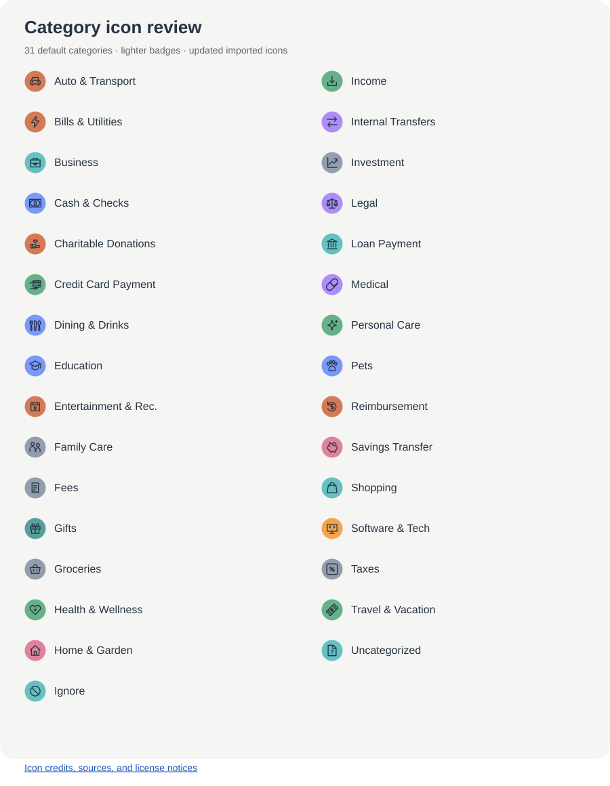

# Categories

The 31 default category labels and icons currently supported by Open Budget. Spending views show categories represented in the selected month.

[Icon sources, credits, and license notes](../frontend/src/assets/categories/README.md)

- Auto & Transport
- Bills & Utilities
- Business
- Cash & Checks
- Charitable Donations
- Credit Card Payment
- Dining & Drinks
- Education
- Entertainment & Rec.
- Family Care
- Fees
- Gifts
- Groceries
- Health & Wellness
- Home & Garden
- Ignore
- Income
- Internal Transfers
- Investment
- Legal
- Loan Payment
- Medical
- Personal Care
- Pets
- Reimbursement
- Savings Transfer
- Shopping
- Software & Tech
- Taxes
- Travel & Vacation
- Uncategorized
